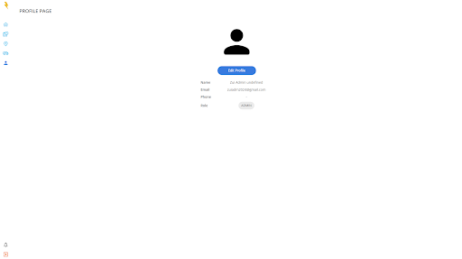
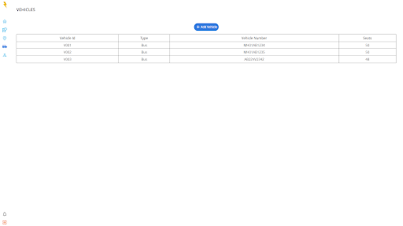
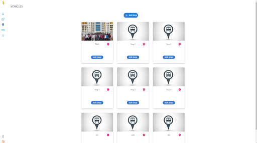
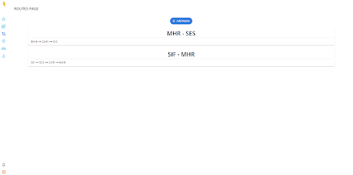
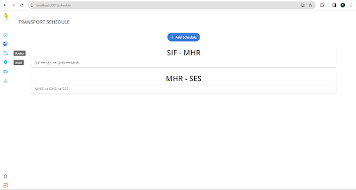

# RidePay - Transportation Management App

A web application which allows the students and faculty to book transport facilities by browsing through the routes and schedules.

Features:
Institute-based login
Schedule viewing for transportation facilities.
Admin access for schedule and route management.
Real-time updates and push notifications for users.
UPI payment using Cashfree payments

## Screenshots

### Landing Page

### Profile Page

### Vehicles Page

### Stops Page

### Routes Page

### Schedule Page

